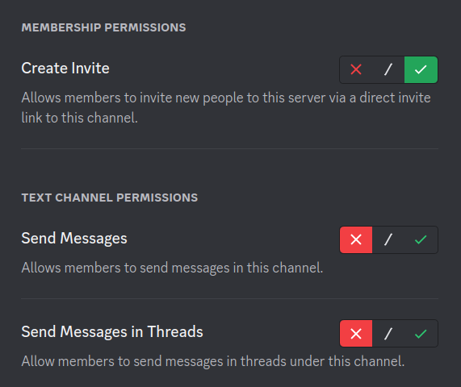
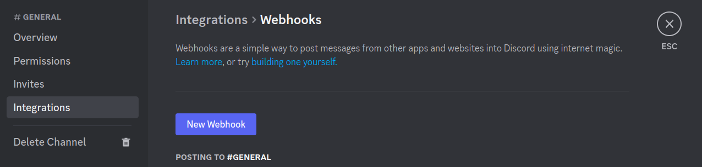
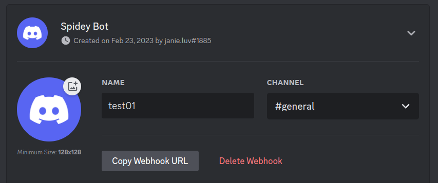
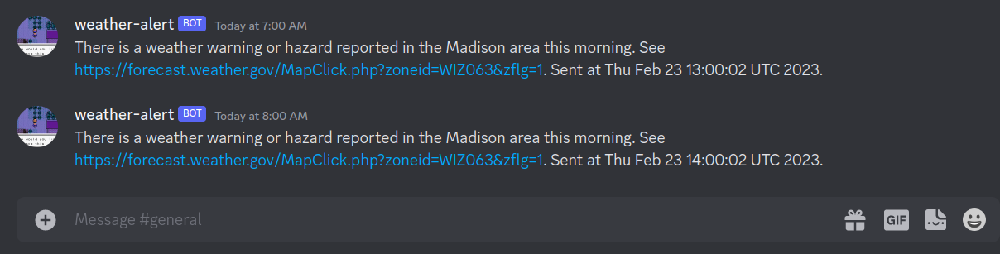

# Text Message Alerting with Discord + Linux

I recently created a simple text message alerting system with Discord bots, a
Bash script, and cron. Here is how to do it yourself! My alerting system uses
[weather.gov](weather.gov) to check for weather advisories in the Madison, WI
area, and sends alert messages when one is found.

First, create a [Discord](https://discord.com/app) account, log in, and hit the
plus sign in the bottom left hand corner to create your own "server". A server
is a group chat with multiple sub-chats, called channels.

<figure>

</figure>

Optionally, within each server channel's settings menu, you can lock down
permissions so that your Discord server is "read-only". In my setup, I set
permissions so that nobody can post in the "general" channel (besides myself and
the bot). This keeps spam out of the server, well-meaning or otherwise, so that
your Discord server functions only as an alerting system. I also delete all
channels allocated by default besides "general".

<figure>

</figure>

Next, within the "general" channel's settings menu, you can create a webhook. In
other words, a bot! You can give your webhook a name and a profile picture.

<figure>

</figure>

The "Copy Webhook URL" button will save your webhook's URL to your clipboard.
Note that this URL should be kept secret: anyone who has this URL can make your
bot whatever they like!

<figure>

</figure>

The webhook URL will look something like the following.

```
https://discord.com/api/webhooks/560145063066/hyASmEfCTRdSYIbXXsiRfU2854s3XIrD
```

Next, create a Bash script on your Linux computer. Mine is very simple: it loads
a [weather.gov](weather.gov) forecast webpage for the Madison area and checks
for the presence of the word "warning", "hazard", or "advisory". If a dire
weather forecast is found, the script tells the bot to fire a message. A simple
HTTPS POST request to our webhook URL allows us to command our bot to send a
message to its Discord channel.

```bash
#!/usr/bin/sh
url='https://forecast.weather.gov/MapClick.php?zoneid=WIZ063&zflg=1'
toalert=$(curl -s "$url" | grep -Ei 'warning|hazard|advisory' | wc -l)
if [ "$toalert" -ge "1" ]
then
    curl -H "Content-Type:application/json" -X POST \
        -d "{\"content\":
        \"There is a weather hazard reported in the Madison area this morning. See $url. Sent at $(date).\"}" \
        'https://discord.com/api/webhooks/560145063066/hyASmEfCTRdSYIbXXsiRfU2854s3XIrD'
fi
```

I schedule my alert system to run weekdays at 6am, 7am, and 8am using
[cron](https://en.wikipedia.org/wiki/Cron).

```
00 12,13,14 * * 1,2,3,4,5 /usr/bin/sh /home/janie/alert.sh
```

Here is what the end result looks like to a Discord user. Anyone who joins your
Discord server on their phone will receive notifications by default when your
bot sends a message.

<figure>
    
</figure>

Finally, you can fire your invite link to the masses-- and your system is live!

<figure>
    
</figure>
